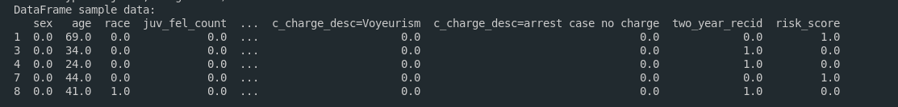
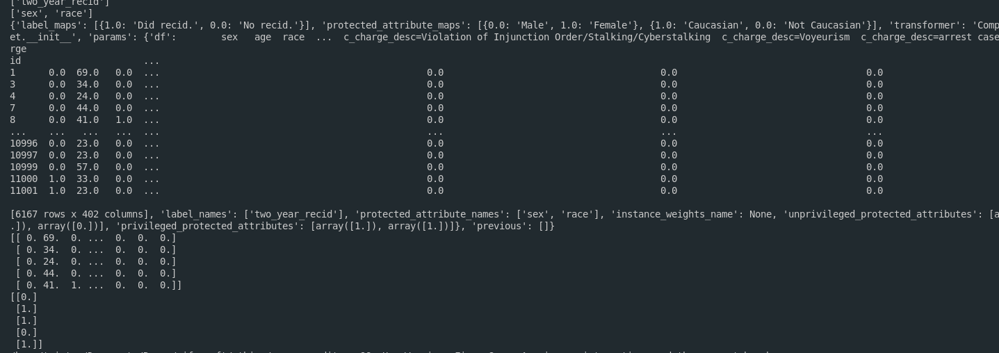

# COMPAS Audit Project

This project performs an audit and analysis of the COMPAS dataset using the AIF360 toolkit and machine learning techniques. The goal is to evaluate fairness and bias in recidivism prediction models.

## Overview

The main script `compas_audit.py` loads the COMPAS dataset, preprocesses the data, trains a logistic regression model, and evaluates fairness metrics such as statistical parity difference and disparate impact ratio. It also provides visualizations to understand the distribution of risk scores and false positive rates by race.

## Features

- Loads and preprocesses the COMPAS dataset using AIF360's `CompasDataset`.
- Defines privileged and unprivileged groups based on race.
- Converts dataset to a pandas DataFrame for visualization.
- Visualizes risk score distribution by race.
- Splits data into training and test sets.
- Standardizes features and trains a logistic regression model.
- Evaluates bias metrics including statistical parity difference and disparate impact ratio.
- Visualizes false positive rates by race.
- Displays confusion matrix for model performance.

## Dependencies

The project requires the following Python packages:

- numpy
- pandas
- matplotlib
- seaborn
- scikit-learn
- aif360

### Optional packages for extended fairness algorithms (warnings may appear if not installed):

- tensorflow (for AdversarialDebiasing)
- fairlearn (for ExponentiatedGradientReduction, GridSearchReduction)
- inFairness (for SenSeI and SenSR)

You can install the required packages using pip:

```bash
pip install numpy pandas matplotlib seaborn scikit-learn aif360
```

For optional packages, install as needed:

```bash
pip install 'aif360[AdversarialDebiasing]'
pip install 'aif360[Reductions]'
pip install 'aif360[inFairness]'
```

## Usage

Clone the repository:

```bash
git clone https://github.com/TristanBrian/ethics.git
cd ethics
```

Run the main script:

```bash
python3 compas_audit.py
```

This will execute the full pipeline, output fairness metrics, and display visualizations.

## File Structure

- `compas_audit.py`: Main script for dataset loading, model training, fairness evaluation, and visualization.
- `img/dataframe.png`: Sample visualization of the dataset dataframe.

  

- `img/train.png`: Sample visualization of the training process or results.

  

## Other Files in the Repository

- `theory.txt`: Contains theoretical background and notes related to ethics and fairness in AI.
- `amazon.case.study.txt`: Case study document related to Amazon, possibly discussing ethical considerations.
- `facial.txt`: Document related to facial recognition or analysis, potentially discussing ethical implications.

## Notes

- The script adds a `risk_score` column to the DataFrame for visualization purposes, using available dataset attributes or labels as a fallback.
- Warnings about missing optional packages can be ignored if you do not require those specific fairness algorithms.

## License

This project is provided for educational purposes only.
